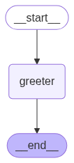

# Hello-World LangGraph

A simple "Hello World" project using **LangGraph**.

---

## Files

* `hello-world-langgraph.py` — main script
* `requirements.txt` — dependencies
* `graph.png` — generated graph diagram
* `LICENSE` — MIT License

---

## Setup

1. Install Python 3.9+
2. Install dependencies:

```bash
pip install -r requirements.txt
```

---

## Run

```bash
python hello-world-langgraph.py
```

Expected output:

```
Result: Hey Bob, how is your day going?
```

Also, `graph.png` will be generated.

---

## Diagram



---

## License

MIT License — see `LICENSE` file for details.
